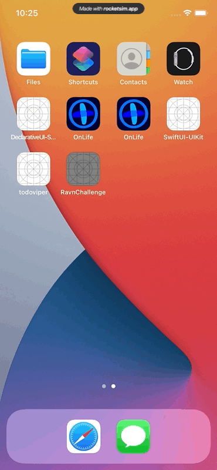
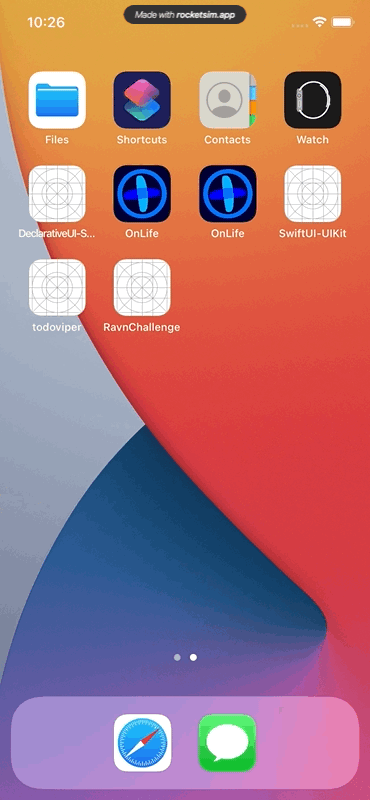

# Ravn Code Challenge

A swifty iOS App that shows StarWars characters.

# Before to Start
- You must have Xcode 12.0 or superior
- If you want to run in a physical device it must have iOS 14.0 or superior

# Technnical Details
- This app use SPM (Swift Package Manager) as its dependency manager
- Use MVVM as architecture
- It's full developed in pure Swift using SwiftUI framework

# How To Run it?
- Open RavnChallenge.xcodeproj
- Wait until Xcode fetch Apollo Client dependency
- Run it in an iOS simulator or a physical device.

# Demo

Fetching Characters

Failed Request

